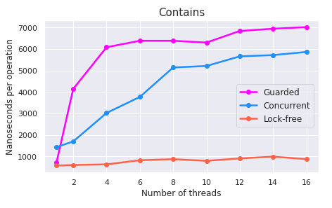

# Benchmark results

For measuring performance we used [Google Benchmark library](https://github.com/google/benchmark). Source code of benchmarks can be found [here](https://github.com/TmLev/skipper/tree/master/benchmarks).

## Description

We've conducted 3 experiments with different setups (described below). Every benchmark ran on several number of threads (from 1 to 16). Performance was measured on Intel Core i7-8565U x86-64 with 8 hyper-threading cores with 1.8 CHz base frequency and 4.6 max turbo frequency. RAM is 32 GB DDR4.

## Experiments

### Contains
This benchmark test `Contains()` method. As a setup we insert 10^6 random numbers from `R = (-10^4; 10^4)`. 

